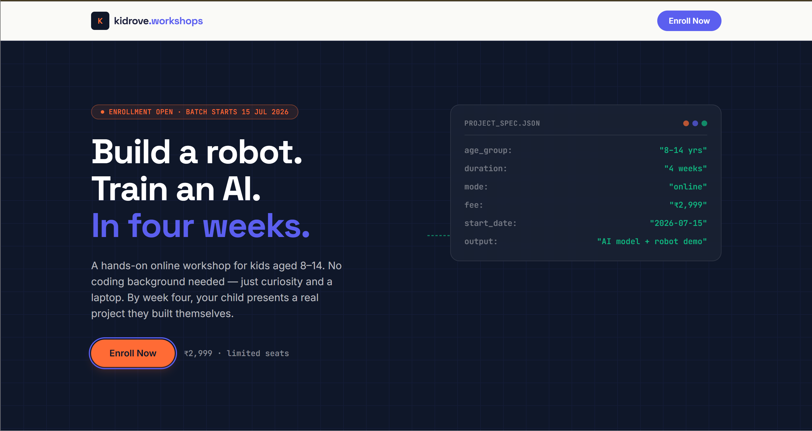
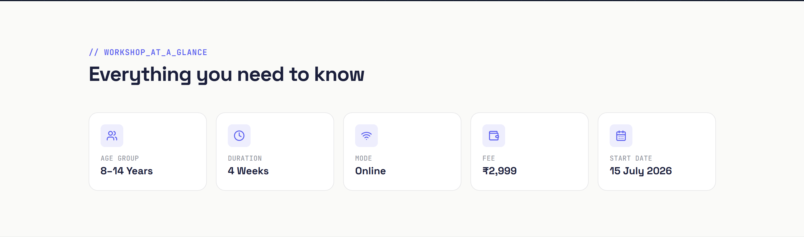
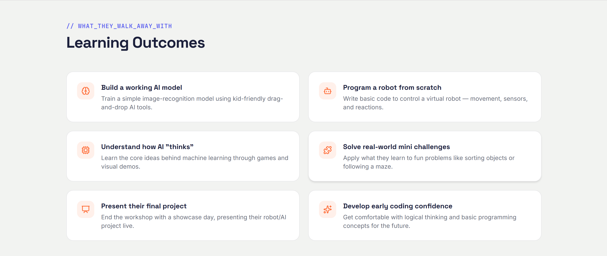
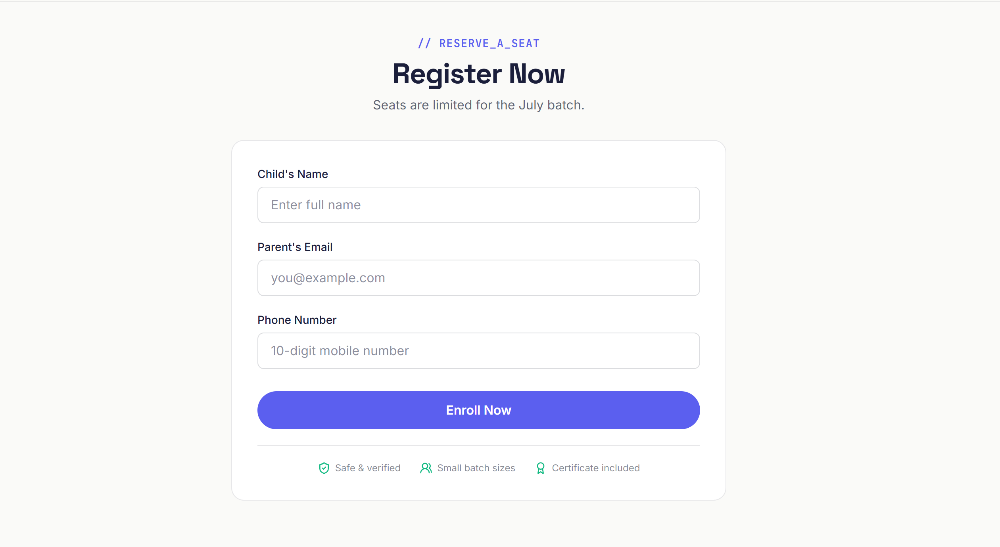

# AI & Robotics Summer Workshop — Landing Page

A responsive workshop landing page built with React, TypeScript, and Tailwind CSS, backed by an Express + MongoDB API for handling registrations.

**Live demo:** https://kidrove-workshop-tau.vercel.app/
**API:** https://kidrove-workshop-backend-0axf.onrender.com/

---

## Screenshots

**Hero**


**Workshop details**


**Learning outcomes**


**Registration form**


---

## Workshop Details

| | |
|---|---|
| **Workshop** | AI & Robotics Summer Workshop |
| **Age Group** | 8–14 Years |
| **Duration** | 4 Weeks |
| **Mode** | Online |
| **Fee** | ₹2,999 |
| **Start Date** | 15 July 2026 |

---

## Features

- Responsive hero section with workshop title, description, and an "Enroll Now" CTA
- Workshop details section (age group, duration, mode, fee, start date)
- 6 learning outcomes plus a 4-week build timeline
- FAQ accordion with 4 questions
- Registration form (name, email, phone) with:
  - Client-side validation and inline error messages
  - Loading state on submit
  - Success and error states
- Express API endpoint (`POST /api/enquiry`) with:
  - Server-side validation of required fields
  - MongoDB persistence (with safe fallback if the database is unreachable)
- Deployed: frontend on Vercel, backend on Render

---

## Tech Stack

**Frontend:** React, TypeScript, Tailwind CSS, Vite, lucide-react
**Backend:** Node.js, Express, TypeScript, Mongoose (MongoDB)

---

## Project Structure

```
kidrove-workshop/
├── frontend/
│   └── src/
│       ├── assets/
│       ├── components/
│       │   ├── FAQ.tsx
│       │   ├── Footer.tsx
│       │   ├── Hero.tsx
│       │   ├── LearningOutcomes.tsx
│       │   ├── Navbar.tsx
│       │   ├── RegistrationForm.tsx
│       │   └── WorkshopDetails.tsx
│       ├── App.tsx
│       ├── index.css
│       ├── main.tsx
│       └── types.ts
└── backend/
    └── src/
        ├── models/
        │   └── Enquiry.ts
        ├── routes/
        │   └── enquiry.ts
        ├── utils/
        │   └── validateEnquiry.ts
        └── server.ts
```

---

## Running Locally

### Prerequisites
- Node.js 18+
- A MongoDB connection string (optional — the API runs without one, in fallback/logging mode)

### Backend

```bash
cd backend
npm install
```

Create a `.env` file in `backend/`:

```
PORT=5000
MONGODB_URI=your-mongodb-connection-string
```

```bash
npm run dev
```

The API runs at `http://localhost:5000`.

### Frontend

```bash
cd frontend
npm install
```

Create a `.env` file in `frontend/`:

```
VITE_API_URL=http://localhost:5000
```

```bash
npm run dev
```

The app runs at `http://localhost:5173`.

---

## API Reference

### `POST /api/enquiry`

Registers a child for the workshop.

**Request body**

```json
{
  "name": "Aanya Sharma",
  "email": "parent@example.com",
  "phone": "9876543210"
}
```

**Validation rules**
- `name` — required, minimum 2 characters
- `email` — required, must be a valid email format
- `phone` — required, must be a valid 10-digit Indian mobile number

**Success response — `201`**

```json
{
  "success": true,
  "message": "Registration received successfully.",
  "data": {
    "id": "...",
    "name": "Aanya Sharma",
    "email": "parent@example.com",
    "phone": "9876543210"
  }
}
```

**Validation error response — `400`**

```json
{
  "success": false,
  "message": "Please correct the highlighted fields and try again.",
  "errors": {
    "email": "A valid email address is required"
  }
}
```

---

## Submission Note

**Approach:** I built the workshop page as a single-purpose React + TypeScript app with Tailwind CSS, structured into clear sections (Hero, Workshop Details, Learning Outcomes, FAQ, Registration) as independent components for readability and reuse. Rather than a generic template look, I designed a "project spec sheet" visual identity — monospace data labels and a real weekly build timeline — fitting the workshop's actual subject. The form includes client-side validation with inline errors and loading/success/error states; the Express backend revalidates the same fields server-side and stores submissions in MongoDB, with a safe fallback if the database is unreachable. Both frontend (Vercel) and backend (Render) are deployed and connected end-to-end.

**With more time:** I'd add automated tests (Jest/React Testing Library), rate-limiting on the API, email confirmation on registration, and an admin view to see submitted enquiries.

---

## License

This project is for educational/demonstration purposes.